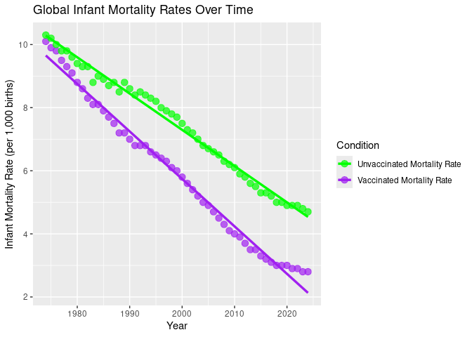

Final Portfolio:
================
Tate McDonald
2025-11-04

- [ABSTRACT](#abstract)
- [BACKGROUND](#background)
- [STUDY QUESTION & HYPOTHESIS](#study-question--hypothesis)
  - [Question](#question)
  - [Hypothesis](#hypothesis)
  - [Predictions & Possible
    Visualizations](#predictions--possible-visualizations)
- [METHODS](#methods)
  - [Procedure](#procedure)
  - [First Analysis: Homework 10](#first-analysis-homework-10)
  - [Second Analysis:](#second-analysis)
- [DISCUSSION](#discussion)
  - [First Analysis: Interpretation](#first-analysis-interpretation)
  - [Second Analysis: Interpretation](#second-analysis-interpretation)
- [CONCLUSION](#conclusion)
- [REFERENCES](#references)

# ABSTRACT

# BACKGROUND

# STUDY QUESTION & HYPOTHESIS

## Question

Do infant vaccinations have a significant impact on the decline of
global infant mortality rates over time?

## Hypothesis

Infants who receive available vaccinations at/near time of birth have a
lower mortality rate than infants who do not receive such vaccinations.

## Predictions & Possible Visualizations

A scatterplot showing data from years 1974-2024 will have two variables:
mortality rates of infants who receive vaccinations, and mortality rates
of infants who do not receive vaccinations (deaths per 1,000 births). A
linear regression model can be used to determine if there is a
significant difference between mortality rates in infants who receive
vaccines vs. those who do not. It is predicted that a linear regression
model will have a small p-value showing that infants who receive
vaccines are much less likely to contribute to the global infant
mortality rates than infants who do not receive vaccines.

# METHODS

## Procedure

## First Analysis: Homework 10

``` r
# Load necessary packages
library(tidyverse)

# Import data
data <- read_csv("Global infant mortality rate with and without vaccines(Sheet1).csv")

# Check the column names to make sure they match
head(data)
```

    ## # A tibble: 6 × 3
    ##    Year `Vaccinated Mortality Rate` `Unvaccinated Mortality Rate`
    ##   <dbl>                       <dbl>                         <dbl>
    ## 1  1974                        10.1                          10.3
    ## 2  1975                         9.9                          10.2
    ## 3  1976                         9.8                          10  
    ## 4  1977                         9.5                           9.8
    ## 5  1978                         9.3                           9.8
    ## 6  1979                         9.1                           9.6

``` r
# Reshape data to long format
data_long <- data %>%
  pivot_longer(
    cols = c(`Vaccinated Mortality Rate`, `Unvaccinated Mortality Rate`),
    names_to = "Condition",
    values_to = "MortalityRate"
  )

# Plot both lines with linear regression fits
ggplot(data_long, aes(x = Year, y = MortalityRate, color = Condition)) +
  geom_point(size = 3, alpha = 0.7) +
  geom_smooth(method = "lm", se = FALSE, linewidth = 1.2) +
  labs(
    title = "Global Infant Mortality Rates Over Time",
    x = "Year",
    y = "Infant Mortality Rate (per 1,000 births)",
    color = "Condition"
  ) +
  scale_color_manual(values = c("Vaccinated Mortality Rate" = "purple", "Unvaccinated Mortality Rate" = "green"))
```

<!-- -->

## Second Analysis:

# DISCUSSION

## First Analysis: Interpretation

## Second Analysis: Interpretation

# CONCLUSION

# REFERENCES
