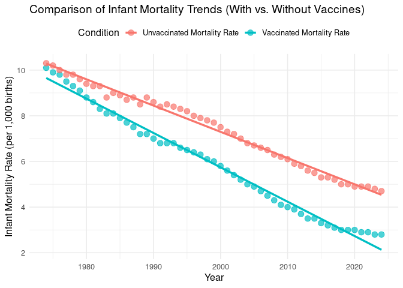

Final Portfolio:
================
Tate McDonald
2025-11-12

- [ABSTRACT](#abstract)
- [BACKGROUND & QUESTION FRAMING](#background--question-framing)
- [STUDY QUESTION & HYPOTHESIS](#study-question--hypothesis)
  - [Question](#question)
  - [Hypothesis](#hypothesis)
  - [Predictions & Possible
    Visualizations](#predictions--possible-visualizations)
- [METHODS](#methods)
  - [Procedure](#procedure)
  - [First Analysis: Comparison of Infant Mortality
    Trends](#first-analysis-comparison-of-infant-mortality-trends)
  - [Second Analysis: Generalized Linear
    Model](#second-analysis-generalized-linear-model)
- [DISCUSSION](#discussion)
  - [First Analysis: Interpretation](#first-analysis-interpretation)
  - [Second Analysis: Interpretation](#second-analysis-interpretation)
- [CONCLUSION](#conclusion)
- [REFERENCES](#references)

# ABSTRACT

# BACKGROUND & QUESTION FRAMING

Throughout recorded history, humans have struggled against nature and
its elements. Countless studies over the centuries have determined there
are many factors–in addition to nature–that contribute to a person’s
health and lifespan. As time has progressed, societies around the world
have discovered and implemented ways to improve quality of life and
increase the average human life expectancy. More humans than ever before
survive into adulthood and are able to reproduce, resulting in an
explosion in the global population over the last two centuries. However,
deaths among infants remain a prevalent and tragic issue, and further
refinements in healthcare technology are in development to combat this.

There is no doubt that improvements in sanitation, healthcare
technology, and basic hygiene have all played a significant role in
lengthening the human lifespan, and these effects can be quantitatively
measured to some degree. Meaningful efforts to improve quality of life
are reflected in the gradual decline in infant deaths per 100,000 births
in the United States (Bastian et al., 2020).[^1] One of the most
prevalent and hotly-debated developments in the last 50 years has been
the advent of routine infant vaccination programs. Many scientific
studies have greatly supported the concept that vaccinations contribute
to the overall increase in human life expectancy through disease
prevention, but have infant vaccination programs had a significant
impact on the gradual decline in infant mortality rates, or can the
decline be better explained by another factor entirely?

``` r
library(tidyverse)

# Import the dataset, skipping the title line
mortality_data <- read_csv("NCHS_-_Childhood_Mortality_Rates.csv", skip = 1)

# Clean and convert the "Death Rate" column:
# - Remove commas
# - Convert to numeric
mortality_data <- mortality_data %>%
  mutate(`Death Rate` = as.numeric(gsub(",", "", `Death Rate`)))

# Plot with a continuous y-axis

ggplot(mortality_data, aes(x = Year, y = `Death Rate`)) +
geom_line(color = "#0072B2", size = 1.2) +
theme_minimal(base_size = 10) +
scale_y_continuous(labels = scales::comma) +
labs(
title = "Childhood Mortality Rates in Children Age 0-4 Years in the U.S. (1900–2018)",
x = "Year",
y = "Death Rate (per 100,000)"
)
```

<!-- -->

# STUDY QUESTION & HYPOTHESIS

## Question

Do infant vaccinations have a significant impact on the decline of
global infant mortality rates over time?

## Hypothesis

Infants who receive available vaccinations at/near time of birth have a
lower mortality rate than infants who do not receive such vaccinations.

## Predictions & Possible Visualizations

A scatterplot showing data from years 1974-2024 will have two variables:
mortality rates of infants who receive vaccinations, and mortality rates
of infants who do not receive vaccinations (deaths per 1,000 births). A
linear regression model can be used to determine if there is a
significant difference between mortality rates in infants who receive
vaccines vs. those who do not. It is predicted that a linear regression
model will have a small p-value showing that infants who receive
vaccines are much less likely to contribute to the global infant
mortality rates than infants who do not receive vaccines.

# METHODS

## Procedure

## First Analysis: Comparison of Infant Mortality Trends

``` r
# Load necessary packages
library(tidyverse)

# Import data
data <- read_csv("Global infant mortality rate with and without vaccines(Sheet1).csv")

# Check the column names to make sure they match
head(data)
```

    ## # A tibble: 6 × 3
    ##    Year `Vaccinated Mortality Rate` `Unvaccinated Mortality Rate`
    ##   <dbl>                       <dbl>                         <dbl>
    ## 1  1974                        10.1                          10.3
    ## 2  1975                         9.9                          10.2
    ## 3  1976                         9.8                          10  
    ## 4  1977                         9.5                           9.8
    ## 5  1978                         9.3                           9.8
    ## 6  1979                         9.1                           9.6

``` r
# Reshape data to long format
data_long <- data %>%
  pivot_longer(
    cols = c(`Vaccinated Mortality Rate`, `Unvaccinated Mortality Rate`),
    names_to = "Condition",
    values_to = "MortalityRate"
  )

# Plot both lines with linear regression fits
ggplot(data_long, aes(x = Year, y = MortalityRate, color = Condition)) +
  geom_point(size = 3, alpha = 0.7) +
  geom_smooth(method = "lm", se = FALSE, linewidth = 1.2) +
  labs(
    title = "Comparison of Infant Mortality Trends (With vs. Without Vaccines)",
    x = "Year",
    y = "Infant Mortality Rate (per 1,000 births)",
    color = "Condition"
  ) +
  theme_minimal(base_size = 12) +
  theme(legend.position = "top")
```

<!-- -->

## Second Analysis: Generalized Linear Model

``` r
# Load required packages
library(tidyverse)
library(broom)

# Import data
data <- read_csv("Global infant mortality rate with and without vaccines(Sheet1).csv")

# Reshape data to long format
data_long <- data %>%
  pivot_longer(
    cols = c(`Vaccinated Mortality Rate`, `Unvaccinated Mortality Rate`),
    names_to = "Condition",
    values_to = "MortalityRate"
  )

# Fit linear model with interaction term
model <- lm(MortalityRate ~ Year * Condition, data = data_long)

# Show model summary
summary(model)
```

    ## 
    ## Call:
    ## lm(formula = MortalityRate ~ Year * Condition, data = data_long)
    ## 
    ## Residuals:
    ##      Min       1Q   Median       3Q      Max 
    ## -0.45097 -0.14736 -0.04261  0.12860  0.66916 
    ## 
    ## Coefficients:
    ##                                           Estimate Std. Error t value Pr(>|t|)
    ## (Intercept)                             237.197267   4.089893   58.00   <2e-16
    ## Year                                     -0.114950   0.002046  -56.19   <2e-16
    ## ConditionVaccinated Mortality Rate       69.449415   5.783982   12.01   <2e-16
    ## Year:ConditionVaccinated Mortality Rate  -0.035502   0.002893  -12.27   <2e-16
    ##                                            
    ## (Intercept)                             ***
    ## Year                                    ***
    ## ConditionVaccinated Mortality Rate      ***
    ## Year:ConditionVaccinated Mortality Rate ***
    ## ---
    ## Signif. codes:  0 '***' 0.001 '**' 0.01 '*' 0.05 '.' 0.1 ' ' 1
    ## 
    ## Residual standard error: 0.2151 on 98 degrees of freedom
    ## Multiple R-squared:  0.9901, Adjusted R-squared:  0.9898 
    ## F-statistic:  3279 on 3 and 98 DF,  p-value: < 2.2e-16

# DISCUSSION

## First Analysis: Interpretation

## Second Analysis: Interpretation

# CONCLUSION

# REFERENCES

[^1]: Bastian, B., Tejada Vera, B., & Arias, E. (2020, August 25). NCHS
    Data Visualization Gallery - mortality trends in the United States.
    Centers for Disease Control and Prevention.
    <https://www.cdc.gov/nchs/data-visualization/mortality-trends/index.htm#citation>.
