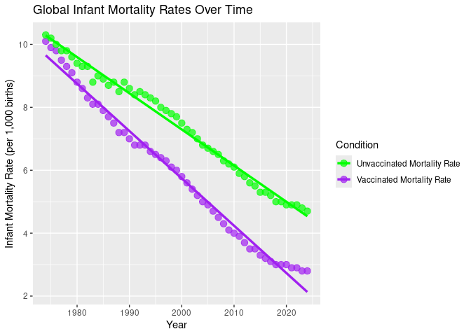
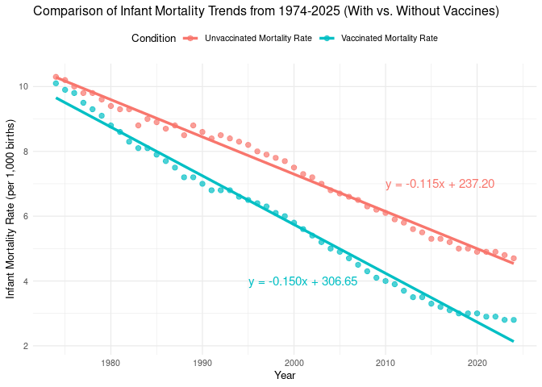

Final Portfolio: Effects of Vaccines on Global Infant Mortality Trends
================
Tate McDonald
2025-12-06

- [ABSTRACT](#abstract)
- [BACKGROUND & QUESTION FRAMING](#background--question-framing)
- [STUDY QUESTION & HYPOTHESIS](#study-question--hypothesis)
  - [Question](#question)
  - [Hypothesis](#hypothesis)
  - [Predictions & Possible
    Visualizations](#predictions--possible-visualizations)
- [METHODS](#methods)
  - [Procedure](#procedure)
  - [First Analysis: Comparison of Global Infant Mortality Trends from
    1974 to
    2024](#first-analysis-comparison-of-global-infant-mortality-trends-from-1974-to-2024)
  - [Second Analysis: Generalized Linear
    Model](#second-analysis-generalized-linear-model)
- [DISCUSSION](#discussion)
  - [First Analysis: Interpretation](#first-analysis-interpretation)
  - [Second Analysis: Interpretation](#second-analysis-interpretation)
  - [Uncertainties & Limitations](#uncertainties--limitations)
- [CONCLUSION](#conclusion)
- [REFERENCES](#references)

# ABSTRACT

This report investigates the effects of vaccines on the global infant
mortality rate, which has declined significantly over the last 150 years
due to several factors. The findings of the study are based on data
submitted and collected by several different world agencies. From 1974
to 2024, the mortality rate for vaccinated and unvaccinated groups of
infants was tracked. By plotting the two trends side-by-side, best fit
lines for each trend were calculated to determine the difference in
decline of mortality rate between the two groups. A generalized linear
model was then implemented to ultimately determine the statistical
significance of the data. An extremely small p-value signified a
meaningful difference in the decline of mortality rate between
vaccinated and unvaccinated groups of infants. The results of the study
suggest vaccinating infants at or near time of birth significantly
reduces rate of death compared to infants who remain unvaccinated. These
findings indicate there are benefits to vaccinating infants, despite the
limitations of the study.

# BACKGROUND & QUESTION FRAMING

Throughout recorded history, humans have struggled against nature and
its elements. Countless studies over the centuries have determined there
are many factors–in addition to nature–that contribute to a person’s
health and lifespan. As time has progressed, societies around the world
have discovered and implemented ways to improve quality of life and
increase the average human life expectancy. More humans than ever before
survive into adulthood and are able to reproduce, resulting in an
explosion in the global population over the last two centuries. However,
deaths among infants remain a prevalent and tragic issue, and further
refinements in healthcare technology are in development to combat this.

There is no doubt that improvements in sanitation, healthcare
technology, and basic hygiene have all played a significant role in
lengthening the human lifespan, and these effects can be quantitatively
measured to some degree. Meaningful efforts to improve quality of life
are reflected in the gradual decline in infant deaths per 100,000 births
in the United States (Bastian et al., 2020).[^1] One of the most
prevalent and hotly-debated developments in the last 50 years has been
the advent of routine infant vaccination programs. Many scientific
studies have greatly supported the concept that vaccinations contribute
to the overall increase in human life expectancy through disease
prevention, but have infant vaccination programs had a significant
impact on the gradual decline in infant mortality rates, or can the
decline be better explained by another factor entirely?

``` r
library(tidyverse)

# Import the dataset, skipping the title line
mortality_data <- read_csv("NCHS_-_Childhood_Mortality_Rates.csv", skip = 1)

# Clean and convert the "Death Rate" column:
# - Remove commas
# - Convert to numeric
mortality_data <- mortality_data %>%
  mutate(`Death Rate` = as.numeric(gsub(",", "", `Death Rate`)))

# Plot with a continuous y-axis

ggplot(mortality_data, aes(x = Year, y = `Death Rate`)) +
geom_line(color = "#0072B2", size = 1.2) +
theme_minimal(base_size = 10) +
scale_y_continuous(labels = scales::comma) +
labs(
title = "Childhood Mortality Rates in Children Age 0-4 Years in the U.S. (1900–2018)",
x = "Year",
y = "Death Rate (per 100,000)"
)
```

<!-- -->

# STUDY QUESTION & HYPOTHESIS

## Question

Do infant vaccinations have a significant impact on the decline of
global infant mortality rates over time?

## Hypothesis

Infants who receive available vaccinations at/near time of birth have a
lower mortality rate than infants who do not receive such vaccinations.

## Predictions & Possible Visualizations

A scatterplot showing data from years 1974-2024 will have two variables:
mortality rates of infants who receive vaccinations, and mortality rates
of infants who do not receive vaccinations (deaths per 1,000 births). A
linear regression model can be used to determine if there is a
significant difference between mortality rates in infants who receive
vaccines vs. those who do not. It is predicted that a linear regression
model will have a small p-value showing that infants who receive
vaccines are much less likely to contribute to the global infant
mortality rates than infants who do not receive vaccines.

# METHODS

## Procedure

This study analyzed a data set depicting two global infant mortality
trends from 1974 to 2024: one trend showing a decline in mortality rate
among vaccinated infants, and another trend showing a decline in
mortality rate among unvaccinated infants (Shattock et al., 2024).[^2]
Two analyses were conducted to test the aforementioned hypothesis. The
first assessment included a comparison of the slopes of the best fit
lines calculated for each mortality trend. Overall percent reduction in
mortality rate for both groups was also taken into consideration. The
second analysis included a generalized linear model (GLM) which
determined if the difference in the slopes of the two trends was
significant enough to provide support for or against the hypothesis.
Results are discussed in the following sections.

## First Analysis: Comparison of Global Infant Mortality Trends from 1974 to 2024

The plot of the data generated by the below code chunk displays
important information pertinent to the main question of this study. Upon
first glance, infants who received vaccinations at or near time of birth
seemed to have experienced a greater reduction in mortality rate than
infants who remained unvaccinated. This concept is reinforced by the
slopes of the best fit lines calculated for each trend. Among vaccinated
groups, there was an average decline in deaths per 1,000 births per year
of about 0.15 from 1974 to 2024. In contrast, unvaccinated groups
experienced a decline in deaths per 1,000 births per year of only about
0.11. Furthermore, vaccinated infant populations in this data set were
shown to experience a 72.3% overall reduction in mortality rate from
1974 to 2024, while unvaccinated infant populations were shown to have a
54.4% reduction in mortality rate within the same time period.

``` r
# Load required packages
library(tidyverse)
library(broom)

# Import data
data <- read_csv("Global infant mortality rate with and without vaccines(Sheet1).csv")

# Reshape data to long format
data_long <- data %>%
  pivot_longer(
    cols = c(`Vaccinated Mortality Rate`, `Unvaccinated Mortality Rate`),
    names_to = "Condition",
    values_to = "MortalityRate"
  )

# Fit separate models for each condition to get equations
model_vaccinated <- lm(MortalityRate ~ Year, 
                       data = filter(data_long, Condition == "Vaccinated Mortality Rate"))
model_unvaccinated <- lm(MortalityRate ~ Year, 
                         data = filter(data_long, Condition == "Unvaccinated Mortality Rate"))

# Extract coefficients
coef_vac <- coef(model_vaccinated)
coef_unvac <- coef(model_unvaccinated)

# Create equation labels
eq_vaccinated <- sprintf("y = %.3fx + %.2f", coef_vac[2], coef_vac[1])
eq_unvaccinated <- sprintf("y = %.3fx + %.2f", coef_unvac[2], coef_unvac[1])

# Plot with equations
ggplot(data_long, aes(x = Year, y = MortalityRate, color = Condition)) +
  geom_point(size = 2, alpha = 0.7) +
  geom_smooth(method = "lm", se = FALSE, linewidth = 1.2) +
  annotate("text", x = 2010, y = 7, 
           label = eq_unvaccinated, 
           color = "#F8766D", size = 4, hjust = 0) +
  annotate("text", x = 1995, y = 4, 
           label = eq_vaccinated, 
           color = "#00BFC4", size = 4, hjust = 0) +
  labs(
    title = "Comparison of Infant Mortality Trends from 1974-2025 (With vs. Without Vaccines)",
    x = "Year",
    y = "Infant Mortality Rate (per 1,000 births)",
    color = "Condition"
  ) +
  theme_minimal(base_size = 10) +
  theme(legend.position = "top")
```

<!-- -->

## Second Analysis: Generalized Linear Model[^3]

This study used a generalized linear model over ANOVA to compare the two
mortality trends because the errors within the data could not be assumed
to be normally distributed, although the data was continuous from 1974
to 2024. From this particular model it was determined that vaccinated
groups of infants on average experienced a greater decline in mortality
rate per year than unvaccinated groups. From 1974 to 2024, groups of
infants who were vaccinated showed a reduction in mortality rate about
0.036 deaths per 1,000 births per year greater than infants who were not
vaccinated. Furthermore, the model returned a p-value of 2.2e-16,
meaning that the difference in the decline of mortality rate of both
groups was statistically significant, and this result was most likely
not due to random chance.

``` r
# Load required packages
library(tidyverse)
library(broom)

# Import data
data <- read_csv("Global infant mortality rate with and without vaccines(Sheet1).csv")

# Reshape data to long format
data_long <- data %>%
  pivot_longer(
    cols = c(`Vaccinated Mortality Rate`, `Unvaccinated Mortality Rate`),
    names_to = "Condition",
    values_to = "MortalityRate"
  )

# Fit linear model with interaction term
model <- lm(MortalityRate ~ Year * Condition, data = data_long)

# Show model summary
summary(model)
```

    ## 
    ## Call:
    ## lm(formula = MortalityRate ~ Year * Condition, data = data_long)
    ## 
    ## Residuals:
    ##      Min       1Q   Median       3Q      Max 
    ## -0.45097 -0.14736 -0.04261  0.12860  0.66916 
    ## 
    ## Coefficients:
    ##                                           Estimate Std. Error t value Pr(>|t|)
    ## (Intercept)                             237.197267   4.089893   58.00   <2e-16
    ## Year                                     -0.114950   0.002046  -56.19   <2e-16
    ## ConditionVaccinated Mortality Rate       69.449415   5.783982   12.01   <2e-16
    ## Year:ConditionVaccinated Mortality Rate  -0.035502   0.002893  -12.27   <2e-16
    ##                                            
    ## (Intercept)                             ***
    ## Year                                    ***
    ## ConditionVaccinated Mortality Rate      ***
    ## Year:ConditionVaccinated Mortality Rate ***
    ## ---
    ## Signif. codes:  0 '***' 0.001 '**' 0.01 '*' 0.05 '.' 0.1 ' ' 1
    ## 
    ## Residual standard error: 0.2151 on 98 degrees of freedom
    ## Multiple R-squared:  0.9901, Adjusted R-squared:  0.9898 
    ## F-statistic:  3279 on 3 and 98 DF,  p-value: < 2.2e-16

# DISCUSSION

## First Analysis: Interpretation

The results of the graph of the data set give evidence to support the
hypothesis that vaccinated groups of infants experience a greater
reduction in mortality rate than unvaccinated groups. Not only is there
a visual distinction between the two trends, but the slopes of both best
fit lines (-0.15 for vaccinated groups and -0.11 for unvaccinated
groups) support the prediction that there is indeed a difference made in
infant mortality rates when infants are vaccinated at or near time of
birth.

## Second Analysis: Interpretation

The results of the generalized linear model also support the hypothesis
that vaccinated groups of infants experience a greater reduction in
mortality rate than unvaccinated groups. It was predicted that the GLM
would produce a p-value that would indicate a significant difference in
the decline in infant mortality rates for vaccinated and unvaccinated
groups. After comparing the differences in the slopes of the best fit
lines obtained from the graph, the model returned a p-value of 2.2e-16,
which is much less than 0.05 and very close to 0.0. This p-value, as
previously mentioned, indicates vaccinated groups of infants experienced
a significantly greater reduction in mortality rate from 1974 to 2024
than unvaccinated groups.

## Uncertainties & Limitations

While the results of this study shed positive light on the effects of
vaccinations, the experiment was not without its limitations. While at
first it was desired to focus on the effects of just a single
vaccination, some vaccines have only recently become available to
pregnant mothers and their infants, and so the data on such vaccines is
sparse. Furthermore, while the data obtained for this study covered more
than 100 countries across the globe, there are differences in how
governments classify individuals as “fully” vaccinated, meaning there
could be instances of overrepresentation or underrepresentation within
both vaccinated and unvaccinated groups. Lastly, causes of death were
not specified when mortality rates were calculated during this study,
and so it is impossible to say if a certain vaccine prevented a death at
any given point in time. Despite these uncertainties, the results of
this particular study were so significant that there is reason to
believe the hypothesis would still be supported even if these
limitations were removed or corrected.

# CONCLUSION

Overall, the results of the analyses conducted in this study provide
strong evidence that supports the hypothesis that routine infant
vaccinations significantly contribute to the overall decline in infant
mortality rates over the last 50 years. Global efforts to improve the
quality of life of children through the administration of vaccines are
indeed proving successful. In conclusion, these results show there could
exist a positive correlation between vaccination status and a longer
lifespan, while at the same time there could be negative consequences
for those who choose not to become vaccinated against diseases. The
results of this experiment could be used to ease the concerns of parents
looking to provide the best for their children, and it is hoped that
more people across the world will contribute positively to the fight
against disease.

# REFERENCES

[^1]: Bastian, B., Tejada Vera, B., & Arias, E. (2020, August 25). NCHS
    Data Visualization Gallery - mortality trends in the United States.
    Centers for Disease Control and Prevention.
    <https://www.cdc.gov/nchs/data-visualization/mortality-trends/index.htm#citation>.

[^2]: Shattock et al. (2024). Contribution of vaccination to improved
    survival and health: modelling 50 years of the Expanded Programme on
    Immunization. The Lancet.

[^3]: ChatGPT. OpenAI, version Jan 2025. Used as a reference for
    functions such as plot() and to correct syntax errors. Accessed
    2025-12-2.
